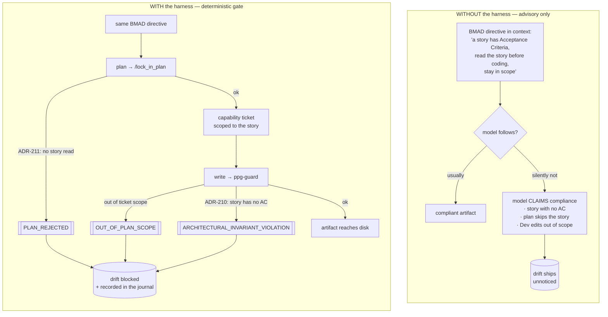
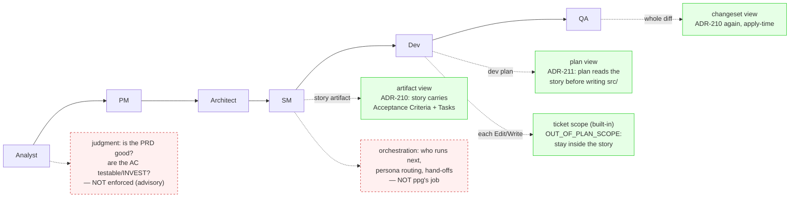

# Is the ppg harness useful for BMAD (and spec-driven methods in general)?

**Short answer: yes — for the mechanical, structural part of the method, plus
observation. Not for the judgment or the multi-agent orchestration.** This
document says exactly where the harness bites and where it deliberately does not.

> [BMAD-METHOD](https://github.com/bmad-code-org/BMAD-METHOD) is a structured
> agentic method: a chain of role agents (Analyst → PM → Architect → Scrum
> Master → Dev → QA) driving a pipeline of documents — brief, PRD, architecture,
> epics, **stories**, then implementation. The `demo/bmad/` corpus is *pure
> usage* of ppg: two `.rego` policies loaded via `-adr demo/bmad/adr`, exactly
> like `examples/adr/*` and `demo/skills/*/SKILL.rego`. **No ppg core code is
> touched, and none needs to be** — ppg is agent-agnostic, and a BMAD session is
> just a normal Claude Code session.

## The shared failure mode: advisory ≠ enforced

Every spec-driven method (BMAD, Spec-Kit, `scratchpad/ai`, a `SKILL.md`) is a
set of **directives in the model's context**. Their weakness is not "the model
refuses to follow the process." It is subtler and worse:

> *« Le problème de ces méthodes et de ces workflows est qu'ils sont des
> directives que le modèle peut ne pas suivre sans qu'on s'en rende compte. »*
>
> The model **claims** it followed the process — it produces a "story", says the
> code is "implemented per the story" — while the story has no acceptance
> criteria, the plan never read it, and the Dev edited three files outside its
> scope. The prose said so; nothing checked. **The drift ships silently.**

That is the exact gap the harness closes, and only for the part that is
mechanically checkable.



The left path is what BMAD gives you today. The right path is what ppg adds —
without changing a line of BMAD.

## Where ppg bites: the three views, mapped onto the BMAD cycle

ppg has exactly **three policy views** (see
[`docs/reference/policy-views.md`](../../docs/reference/policy-views.md)):
`plan` (at `/lock_in_plan`), `artifact` (at `/verify_artifact`, per-write via the
`ppg-guard` hook), and `changeset` (at `/verify_changeset`, the apply-time diff
backstop). That scope is small **on purpose** — the thesis of this repo is that
these three altitudes are the correct-by-design surface, and the demo does not
extend it. It maps cleanly onto BMAD:



| BMAD moment | ppg view | Rule in `demo/bmad/adr` | Refusal |
|---|---|---|---|
| SM hands a story to Dev | `artifact` | **ADR-210** `bmad_story_schema_complete` (compensatory) | `ARCHITECTURAL_INVARIANT_VIOLATION` (HTTP 422) |
| Dev plans the implementation | `plan` | **ADR-211** `bmad_plan_references_story` (amplifier) | `PLAN_REJECTED` (HTTP 422) |
| Dev edits files | ticket scope (built-in, no ADR) | `OUT_OF_PLAN_SCOPE` from the capability ticket | HTTP 403 |
| QA / apply-time diff | `changeset` | **ADR-210** again over the whole diff | HTTP 422 |

`demo/bmad/run-bmad-tests.sh` proves each of these deterministically (10/10
assertions), each shown in both worlds — WITHOUT (a plain file write, nothing
checks it) and WITH (ppg refuses the identical bytes).

## The honest boundary: what ppg does NOT do for BMAD

This matters as much as what it does. Overselling the harness is the fastest way
to lose trust in it.

- **Foyer A — mechanical / structural (ppg enforces).** Section presence, "read
  the contract first", scope confinement, apply-time diff. This is ADR-210,
  ADR-211, and the ticket. Deterministic, model-independent.
- **Foyer B — judgment (stays advisory).** *Are* the acceptance criteria good,
  testable, INVEST-shaped? Does the code truly satisfy them? That is human /
  review / a stronger-model concern. ppg checks that the AC section **exists**,
  never that it is **good** — see "What we do NOT write here" in both ADRs.
- **Foyer C — belongs to another system.** Test execution, CI, deployment gates.
- **Foyer D — personas & orchestration.** BMAD's real value-add is the chain of
  role agents and the document pipeline between them. **ppg is not a workflow
  engine** and does not sequence agents, route personas, or manage hand-offs. It
  is a gate each step passes *through*, not the thing that decides which step
  runs next.

If a rule you want requires *judging quality* or *running the next agent*, it is
out of ppg's scope by design. Keep it in BMAD's prose (Foyer B) or another tool
(Foyer C/D).

## Amplifier vs compensatory, applied to BMAD

The repo classifies every invariant by one test: *would it still be useful if
the model were twice as smart?* (see
[`docs/reference/adr-front-matter.md`](../../docs/reference/adr-front-matter.md)
and the sandbox `CLASSIFICATION.md`).

- **ADR-211 is an amplifier** (`sunset_condition: null`). "Read the story before
  you write code" is a coordination invariant. A smarter model reads the story
  *more* thoroughly — it never makes acknowledging the contract pointless. This
  is the BMAD analogue of ADR-203 (API changes are contract-first).
- **ADR-210 is compensatory** (`sunset_condition` non-null). It is a *tripwire*
  against a model that under-fills the story template. The day BMAD's own
  `validate-create-story` gate runs in CI and rejects incomplete stories
  upstream, this rule is redundant and should be retired. It compensates for a
  weakness; it is not a durable truth.

That an honest demo ships a rule *designed to be deleted later* is the point: the
harness distinguishes durable invariants from temporary crutches, and says which
is which in the front-matter.

## The part you can't get from BMAD alone: observation

Advisory drift is invisible *because nothing records it*. Every ppg decision —
lock, refuse, allow — is emitted to the decision journal
(`internal/journal`), which feeds the live SSE dashboard and the `ppg report`.
So beyond blocking the three drifts, the harness turns them into **events you can
count**: how many stories were rejected for missing AC this week, how many plans
skipped the story, how many out-of-scope edits were attempted. BMAD's prose
produces none of this; a governed BMAD session produces all of it. (See the
telemetry pillar in the project notes.)

## Verify it yourself

```bash
# The corpus loads (a .rego that doesn't compile => the server refuses to boot):
go run ./cmd/ppg -adr demo/bmad/adr -addr 127.0.0.1:8799
#   ADR store loaded: 2 invariants
#   Plan linter ready: 2 policies

# The deterministic proof — 10 assertions, each WITHOUT vs WITH the harness:
bash demo/bmad/run-bmad-tests.sh
#   Summary: 10 passed, 0 failed
```

## Related

- [`LIVE-DEMO.md`](LIVE-DEMO.md) — the presenter's live, four-Act walkthrough:
  install real BMAD, toggle the ppg gateway, watch the drift ship then get blocked.
- [`run-bmad-tests.sh`](run-bmad-tests.sh) — the reproducible driver behind the
  table above.
- [`adr/ADR-210-story-has-acceptance-criteria.md`](adr/ADR-210-story-has-acceptance-criteria.md),
  [`adr/ADR-211-plan-references-story.md`](adr/ADR-211-plan-references-story.md) —
  the two BMAD invariants, with their rationale and their honest "what we do NOT
  check here" sections.
- The sandbox analysis this mirrors:
  [`../../sandbox/README.md`](../../sandbox/README.md),
  [`../../sandbox/CLASSIFICATION.md`](../../sandbox/CLASSIFICATION.md),
  [`../../sandbox/GAP-ANALYSIS.md`](../../sandbox/GAP-ANALYSIS.md).
- [`../../docs/reference/policy-views.md`](../../docs/reference/policy-views.md) —
  the three views in full.
