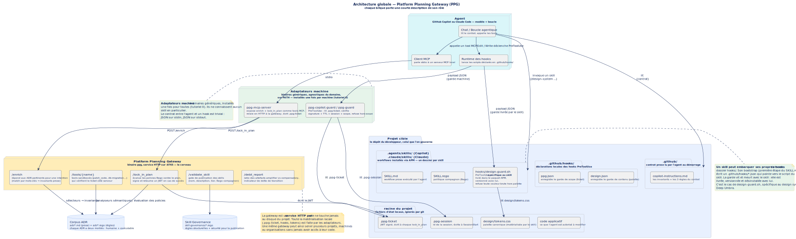

# Platform Planning Gateway — comprendre l'ensemble

> **Objet** : ce document raconte l'histoire complète de la Platform
> Planning Gateway (PPG) et de la manière dont elle gouverne une session
> d'agent (GitHub Copilot ou Claude Code). Il est auto-portant : aucune
> lecture préalable n'est requise. Les termes techniques figés (`MCP`,
> `Rego`, `JWT`, `PreToolUse`, `lock_in_plan`, `ADR`) sont conservés dans
> leur forme d'origine, avec une glose française à leur première
> apparition.

## Table des matières

1. [Vue d'ensemble](#1-vue-densemble)
2. [Comment l'agent est-il *guidé* vers le MCP ?](#2-comment-lagent-est-il-guidé-vers-le-mcp-)
3. [Le plan et son verrou (`lock_in_plan`)](#3-le-plan-et-son-verrou-lock_in_plan)
4. [Le ticket JWT — la phase d'implémentation](#4-le-ticket-jwt--la-phase-dimplémentation)
5. [Anatomie d'un skill compatible](#5-anatomie-dun-skill-compatible)
6. [L'histoire complète, de bout en bout](#6-lhistoire-complète-de-bout-en-bout)

---

## 1. Vue d'ensemble

> **En une phrase** : la PPG est un serveur HTTP local qui *enrichit* la
> phase de planification d'un agent (elle lui livre les invariants
> architecturaux qui s'appliquent à sa tâche), qui *verrouille* le plan
> qu'il propose (via un linter Rego déterministe), puis lui remet un
> **ticket JWT** qui borne ses capacités pendant la phase d'application.
> Un ou plusieurs *hooks* côté client vérifient ce ticket à chaque
> édition ; toute modification hors du scope du plan est refusée avant
> exécution.

L'architecture est composée de cinq pièces :



| Pièce | Où elle vit | Rôle |
|---|---|---|
| **Gateway PPG** | binaire `ppg`, HTTP `:8765` | expose `/enrich`, `/lock_in_plan`, `/tools/{name}`, `/validate_skill`, `/debt_report` |
| **Corpus ADR** | fichiers `adr/*.md` + `adr/*.rego` | chaque ADR a une moitié *sémantique* (invariants prose) et une moitié *exécutable* (Rego) |
| **Adaptateurs** | binaires locaux (`ppg-mcp-server`, `ppg-copilot-guard`, `ppg-guard`) | traduisent entre l'agent et la gateway |
| **Contrat + hooks du projet** | `.github/copilot-instructions.md` (ou `CLAUDE.md`), `.github/hooks/*.json` | soft (contrat prose lu par l'agent) + hard (subprocess qui refuse) |
| **Skills** | `.agents/skills/*` ou `.claude/skills/*` | workflows distribués (paquet APM) qui invoquent la gateway |

Le point important : **la gateway n'écrit jamais sur le disque du projet**.
Elle est un service HTTP pur. Toute la matérialisation locale
(`.ppg-ticket`, `.ppg-session`, `.github/hooks/`) est faite par les
adaptateurs côté client. Cette séparation permet à la gateway d'être
partagée entre projets, machines ou même organisations, sans jamais
avoir besoin d'accès à leur code.

Trois *piliers* portent l'ensemble :

1. **Amplification** (soft) — `POST /enrich` livre à l'agent les
   invariants pertinents pour son intention. Ce sont des **règles
   architecturales** (« tout appel externe passe par le proxy egress »)
   et non des recettes (« modifie le fichier X ligne Y »). L'agent
   raisonne dessus.
2. **Verrouillage** (hard) — `POST /lock_in_plan` évalue le plan proposé
   par l'agent contre les policies Rego. Soit il renvoie des
   *violations sémantiques* que l'agent lit et corrige, soit il renvoie
   un ticket JWT signé.
3. **Garde** (hard) — un *hook* `PreToolUse` (subprocess trivial :
   binaire Go ou script shell) refuse toute édition qui sort du scope du
   ticket, avant que le tool ne soit exécuté.

---

## 2. Comment l'agent est-il *guidé* vers le MCP ?

> **En une phrase** : on ne **force** pas l'agent à appeler MCP au
> moment de la planification ; on **rend impossible toute modification
> sans ticket**, et le seul chemin qui produit un ticket passe par MCP.
> Le mécanisme force le flux en amont depuis un unique point de contrôle
> en aval.

### 2.1 La couche soft — le contrat

Chaque projet gouverné porte un fichier d'instructions que l'agent lit
au démarrage de la session :

- pour GitHub Copilot : `.github/copilot-instructions.md`,
- pour Claude Code : `CLAUDE.md`,
- (le fichier est ensemencé automatiquement par
  `adapters/preflight` avec les invariants pertinents pour l'intention).

Ce fichier contient un contrat comportemental court :

> - Avant toute planification, appeler `get_platform_guidelines_for_intent`.
> - Avant toute modification, soumettre le plan via `lock_in_plan`.
> - Si un tool refuse avec `OUT_OF_PLAN_SCOPE`, ne pas ré-essayer :
>   soit rester dans le scope, soit re-planifier.

L'agent honore ce contrat parce que c'est un modèle raisonnable ; **mais
rien de technique ne l'y contraint à ce stade**. Le fichier est
consultatif.

### 2.2 La couche hard — le garde

Le hook `PreToolUse` (`ppg-copilot-guard` ou `ppg-guard`) est enregistré
dans `.github/hooks/ppg.json` (Copilot) ou `.claude/settings.json`
(Claude Code). Il est appelé par le runtime de l'agent **avant chaque
appel de tool** de type `Edit` ou `Write`, avec en entrée sur `stdin` la
description JSON de l'appel (nom du tool, chemin cible, contenu à
écrire).

Ce hook lit `.ppg-ticket` dans la racine du projet. **En l'absence de
ticket, il refuse l'édition** (`No capability ticket found`). **Avec un
ticket, il vérifie** :

- que la signature HMAC du JWT est valide,
- que la TTL n'est pas dépassée (15 minutes),
- que la `session_id` du ticket correspond à la session courante,
- que la cible de l'édition figure dans `scope.allow_modify`.

Le hook émet ensuite sur `stdout` une décision JSON (`allow` ou `deny`
avec une raison sémantique). Le runtime de l'agent applique la décision
avant même de considérer l'exécution du tool.

### 2.3 Pourquoi ça marche

Le ticket est *le seul* moyen d'obtenir l'autorisation d'écrire.
Or `.ppg-ticket` n'est produit que par le serveur MCP, en réponse à un
appel `lock_in_plan` accepté par la gateway. Et pour qu'un plan soit
accepté, il doit satisfaire les policies Rego — lesquelles reposent
souvent sur ce que `enrich` a révélé (« le plan touche un provider de
paiement mais n'inclut pas d'étape passant par l'egress proxy → rejet
avec un message pointant l'invariant »).

**En pratique** :

- Un agent qui essaie de sauter la phase MCP se heurte au hook dès la
  première écriture. Il lit la raison du refus (« No capability ticket
  found ... appelle `lock_in_plan` ») et corrige sa trajectoire.
- Un agent qui appelle `lock_in_plan` avec un plan désaligné se heurte
  au linter Rego. Il lit les violations et corrige, ce qui l'oblige
  souvent à d'abord appeler `enrich` pour comprendre les invariants
  attendus.

Le contrôle ne s'applique pas au moment de la planification (impossible
à intercepter proprement) mais **au moment de la modification** — le
seul instant où le comportement de l'agent devient observable et
arrêtable.

---

## 3. Le plan et son verrou (`lock_in_plan`)

> **En une phrase** : le plan est un objet JSON structuré (`steps` avec
> `id`, `action`, `tool`, `targets`) soumis à `POST /lock_in_plan` ; le
> linter Rego l'évalue contre les ADR ; en cas de succès, il renvoie un
> JWT signé (le *ticket*).

### 3.1 Le contrat du plan

```json
{
  "session_id": "uuid",
  "intent": "Ajouter la méthode Seka au checkout",
  "repository_context": { "name": "checkout-service", "tech_stack": ["Go"] },
  "steps": [
    { "id": "s1", "action": "migration", "tool": "db-migration-generator",
      "targets": ["migrations/001_seka.sql"] },
    { "id": "s2", "action": "edit router", "tool": "patch_code",
      "targets": ["internal/payment/router.go"] },
    { "id": "s3", "action": "go test ./...", "tool": "go-test",
      "targets": ["tests/integration_payment_test.go"] }
  ]
}
```

Le schéma est décrit dans `schemas/plan.schema.json` ; la source de
vérité côté Go est `internal/plan.Plan`. Le champ `tool` est libre : les
policies reconnaissent aussi bien le vocabulaire de la plateforme
(`patch_code`, `go-test`, `db-migration-generator`) que celui des agents
de code (une étape `Bash` dont l'action lance `go test`, une migration
exprimée comme cible sous `migrations/`).

### 3.2 Le linter Rego

À chaque `lock_in_plan`, la gateway exécute *toutes* les policies Rego
présentes dans le corpus ADR contre le plan. Chaque policy est un
prédicat qui accumule des violations. Exemples actuels :

- `ADR-051.rego` — une étape SQL doit être précédée (ou accompagnée)
  d'une migration.
- `ADR-060.rego` — un plan Go doit inclure une étape de test.
- `ADR-070.rego` — certains chemins sont gelés (`internal/auth/`,
  `internal/old_payment.go`) et interdits d'édition.
- `ADR-090.rego` — un plan qui touche un fichier UI doit inclure une
  étape lisant `design/tokens.css`.

En cas de violation, la gateway répond :

```json
{
  "status": "PLAN_REJECTED",
  "violations": [
    { "policy_id": "go_tests_present",
      "message": "Ajoutez une étape dont le tool est \"go-test\" ...",
      "nature": "amplifier" }
  ],
  "guidance": "Corrigez les violations et re-soumettez."
}
```


Le message est **actionnable** : il nomme le critère exact à corriger.
Le champ `nature` permet à la plateforme de tagger la policy comme
*amplifier* (règle durable, valide même contre un modèle parfait) ou
*compensatory* (contournement d'une limitation actuelle du modèle,
appelé à disparaître).

### 3.3 Le succès et le ticket

Quand toutes les policies passent, la gateway :

1. calcule `plan_hash = SHA-256(plan_canonique)`,
2. dérive `scope.allow_modify = union des steps[].targets` et
   `scope.allow_tool = union des steps[].tool`,
3. lit la `session_id` (le MCP server la substitue par la vraie session
   courante lue dans `.ppg-session`),
4. signe un JWT HS256 avec `iat`, `exp = iat + 15 min`, `plan_hash`,
   `session_id`, `scope`,
5. retourne `{ "status": "PLAN_LOCKED", "execution_ticket": "eyJ...", "plan_hash": "..." }`.

Le serveur MCP écrit le token dans `.ppg-ticket` au niveau du projet
(mode 0600), où les gardes iront le lire.

---

## 4. Le ticket JWT — la phase d'implémentation

> **En une phrase** : **oui**, le JWT n'est utilisé qu'à partir du
> moment où l'agent commence à modifier des fichiers. La phase de
> planification n'a besoin d'aucun ticket ; elle appelle `/enrich` et
> `/lock_in_plan` librement. Le ticket ne devient un objet vivant qu'au
> premier `Edit`/`Write`.

### 4.1 Qui vérifie le ticket ?

Deux vérificateurs :

- **Le hook `PreToolUse`** (côté client, dans l'agent). Il lit
  `.ppg-ticket`, vérifie signature + TTL + session + scope, et refuse
  déterministiquement avec `OUT_OF_PLAN_SCOPE` si la cible n'est pas
  autorisée. C'est le chemin normal, activé sur chaque édition.
- **Les smart tools** (`POST /tools/{name}` sur la gateway). Même
  vérification côté serveur, pour les scénarios sans hook (workflow
  `curl`, script CI, adaptateur pour un agent tiers). Le ticket est
  passé dans le corps de la requête.

Les deux appellent la même fonction interne, `smarttools.GuardTargets`,
qui décode le JWT, vérifie les claims et compare `targets` à
`scope.allow_modify`. Un désaccord retourne un objet
`OutOfScopeError{Attempted, Allowed}` qui alimente le message sémantique.


### 4.2 Anatomie du JWT

| Claim | Type | Sens |
|---|---|---|
| `iat` / `exp` | int | Émis à / expire à (TTL = 15 min) |
| `session_id` | uuid | Session à laquelle le ticket est *lié*. Un ticket copié dans une autre session est refusé (`SESSION_MISMATCH`). |
| `plan_hash` | sha256 hex | Empreinte canonique du plan verrouillé — permet de vérifier que le ticket correspond bien au plan qu'on croit. |
| `scope.allow_modify` | string[] | Fichiers autorisés à la modification (les `targets` de chaque `step`). Un chemin terminé par `*` autorise le sous-arbre. |
| `scope.allow_tool` | string[] | Tools autorisés à l'appel (les `tool` de chaque `step`). |

Le ticket est un **bearer capability** : celui qui possède le fichier
possède le droit. Deux mécanismes en réduisent la surface :

- **TTL 15 minutes** : au-delà, le hook refuse (`TICKET_EXPIRED`).
  Aucune API de renouvellement — il faut re-verrouiller un plan.
- **Session binding** : le hook `SessionStart` écrit la vraie session_id
  courante dans `.ppg-session` et purge tout `.ppg-ticket` laissé par
  une session précédente. Le MCP server injecte ce même `session_id`
  dans le plan au moment du lock, si bien que le ticket porte l'identité
  de sa session d'origine. Toute réutilisation depuis une autre session
  est refusée.

### 4.3 Composition de plusieurs gardes

Le contrat `PreToolUse` d'un agent supporte plusieurs hooks enregistrés
sur le même événement. Ils sont exécutés en parallèle par le runtime et
**la décision la plus restrictive gagne** (`deny > ask > allow`).

Cette propriété permet de composer plusieurs politiques indépendantes :

- `ppg-copilot-guard` gère le *path-scope* (est-ce que ce fichier est
  dans le scope du ticket ?),
- `design-guard.sh` (livré par le skill `design-system`) gère le
  *content-scope* (est-ce que le contenu écrit contient une couleur
  brute hors palette ?),
- rien n'empêche d'en ajouter d'autres (voix éditoriale, clés i18n,
  en-têtes de licence...).


Chaque hook ignore l'existence des autres ; c'est le runtime qui compose.

---

## 5. Anatomie d'un skill compatible

> **En une phrase** : un skill est un répertoire contenant `SKILL.md`
> (le workflow prose que l'agent exécute) et, dès qu'il touche à des
> fichiers, un `SKILL.rego` compagnon (la politique qui l'exige de la
> plateforme). Il est distribué via APM, validé par la gateway, et
> installé par projet dans `.agents/skills/`.


### 5.1 Structure minimale

```
mon-skill/
├── SKILL.md         (front-matter YAML + corps Markdown du workflow)
└── SKILL.rego       (obligatoire dès que le corps mentionne Edit/Write/Bash)
```

**Front-matter obligatoire** (validé par `POST /validate_skill`) :

| Champ | Règle |
|---|---|
| `name` | kebab-case minuscule, ≤ 32 caractères |
| `description` | 50 à 500 caractères, commence par un verbe au présent 3ᵉ personne (« Adds… », « Applies… ») |
| `version` | semver |
| `argument-hint` | requis si le corps utilise `$ARGUMENTS` |

**Corps** : la prose que l'agent exécute. Elle doit suivre le contrat :
appeler `get_platform_guidelines_for_intent`, dresser un plan, appeler
`lock_in_plan`, appliquer dans le scope. Deux exemples réels sont
livrés dans `demo/skills/` :

- `add-payment-method` — workflow *classique* : le skill exécute les
  trois moves et ne suppose rien de plus.
- `design-system` — workflow *étendu* : sa première étape est un
  bootstrap qui matérialise ses propres ressources (`tokens.css`) et
  enregistre son propre hook (`design-guard.sh`) dans
  `.github/hooks/design.json`. À partir de la deuxième étape, chaque
  édition passe donc par deux gardes (tickets + palette).

### 5.2 Le compagnon Rego

Dès que le corps mentionne `Edit`, `Write` ou `Bash`, le linter de
skills (`internal/skill/linter.go`) refuse la publication sans un
`SKILL.rego` compagnon. Structure minimale (mêmes primitives que les
policies d'ADR) :

```rego
package ppg.skills.mon_skill

import rego.v1

violation contains v if {
    some step in input.steps
    # ...condition sur le plan...
    v := {
        "policy_id": "ma_regle",
        "message":   "Message actionnable pour l'agent.",
        "nature":    "amplifier",
    }
}
```

À terme (Gate 3 dans le vocabulaire de la plateforme), la gateway
évaluera automatiquement ces règles compagnon à chaque `lock_in_plan`
dont le plan déclare invoquer un skill. Aujourd'hui la PoC ne
matérialise que Gate 1 (la publication) ; Gate 2 (l'installation) et
Gate 3 (l'exécution) sont documentées dans `AUDIT.md`.

### 5.3 Les tiers de sécurité

Dérivés automatiquement du corps du skill :

| Tier | Déclencheur | Signification |
|---|---|---|
| 0 | ni `Edit`/`Write` ni `Bash` | Lecture seule, auto-approuvable |
| 1 | contient `Edit` ou `Write` | Modifications de fichiers — gate CI + Rego compagnon obligatoire |
| 2 | contient `Bash` | Accès shell — revue humaine requise |

La dérivation est délibérément naïve (substring match sur le corps) et
sera durcie en production par une allowlist deny-by-default.

### 5.4 Distribution via APM

```bash
apm install owulveryck/poc-agentic-platform/demo --target copilot
# → dépose les skills sous .agents/skills/
apm install owulveryck/poc-agentic-platform/demo --target claude
# → dépose les skills sous .claude/skills/
```

APM (Agent Package Manager) est un simple outil de sync git-tag →
répertoire local. `includes: auto` dans `apm.yml` fait que tout skill
placé dans `demo/skills/` est automatiquement embarqué dans le paquet.
Aucune configuration à modifier pour ajouter un nouveau skill.

### 5.5 Invocation

L'agent découvre les skills sous `.agents/skills/` (ou
`.claude/skills/`) et les rend disponibles comme *slash commands* :

```
/design-system Construis-moi une landing page avec un CTA
/add-payment-method Stripe
```

Le corps de `SKILL.md` s'exécute dans le contexte de la session : les
appels MCP au `ppg` server sont natifs, les hooks configurés dans
`.github/hooks/` s'appliquent naturellement à toutes les éditions qu'il
produit.

---

## 6. L'histoire complète, de bout en bout


Un déroulé linéaire, du prompt à l'application :

1. **Le développeur** ouvre son projet dans Copilot (ou Claude Code) et
   demande : *« Ajoute la méthode Seka au checkout. »*
2. **L'agent** lit `.github/copilot-instructions.md`. Ce contrat lui
   rappelle qu'avant toute planification il doit appeler
   `get_platform_guidelines_for_intent`.
3. **L'agent** appelle ce tool via MCP. Le serveur MCP (subprocess
   `stdio`) relaie vers `POST /enrich` sur la gateway.
4. **La gateway** matche l'intention (`Seka`, `payment`, `checkout`)
   contre les `scope_selectors` de chaque ADR. Elle retourne les
   invariants pertinents : ADR-042 (tout appel externe passe par le
   proxy egress) et ADR-070 (les chemins `internal/auth/` et
   `internal/old_payment.go` sont gelés).
5. **L'agent** intègre ces invariants dans son contexte de planification
   et rédige un plan structuré (une étape de migration, une édition du
   routeur, une étape de test).
6. **L'agent** appelle `lock_in_plan` via MCP. Le serveur MCP relaie
   vers `POST /lock_in_plan`.
7. **La gateway** évalue toutes les policies Rego. Si le plan est
   complet, elle signe un JWT (`plan_hash`, `scope`, `session_id`, TTL
   15 min) et le retourne.
8. **Le serveur MCP** écrit le JWT dans `.ppg-ticket` au niveau du
   projet.
9. **L'agent** effectue son premier `Edit`. Le runtime déclenche le hook
   `PreToolUse`.
10. **Le hook `ppg-copilot-guard`** lit `.ppg-ticket`, vérifie signature
    + TTL + session + scope. Si la cible est dans le scope, il émet
    `{"continue": true}` et le tool est exécuté. Sinon, il émet un
    `deny` avec la raison `OUT_OF_PLAN_SCOPE`, listant le scope autorisé
    et suggérant de re-planifier.
11. **L'agent** poursuit dans le scope. Si le développeur demande une
    dérive (« modifie aussi `internal/auth/login.go` »), le hook refuse
    de la même façon — l'agent, guidé par son contrat, ne réessaie pas
    la même action, il choisit soit de rester dans le plan soit de le
    re-verrouiller.
12. **À la fin**, le développeur voit son diff : conforme aux invariants,
    limité aux fichiers annoncés, testé, et si un skill portait un
    content-scope (couleurs, i18n, etc.), aussi conforme sur les
    valeurs.

### Commandes de vérification

Le lecteur peut lancer lui-même ces sondes pour observer les mécanismes
en direct (avec le tutoriel 0 déjà installé et la gateway sur `:8765`) :

```bash
# 1. Ce que voit un agent sur une intention paiement
curl -s -X POST localhost:8765/enrich -H 'Content-Type: application/json' \
  -d '{"intent":"Add Seka payment method","repository_context":{"name":"checkout","tech_stack":["Go"]}}' \
  | python3 -m json.tool | head -30

# 2. Un plan incomplet, pour voir un rejet Rego
curl -s -X POST localhost:8765/lock_in_plan -H 'Content-Type: application/json' \
  -d '{"session_id":"11111111-1111-1111-1111-111111111111","intent":"Add Seka","repository_context":{"name":"checkout","tech_stack":["Go"]},"steps":[{"id":"s1","action":"edit","tool":"patch_code","targets":["internal/payment/router.go"]}]}' \
  | python3 -m json.tool

# 3. Décoder les claims d'un ticket JWT une fois obtenu
python3 -c "import base64,json; p=open('.ppg-ticket').read().strip().split('.')[1]; \
print(json.dumps(json.loads(base64.urlsafe_b64decode(p+'='*(-len(p)%4))), indent=2))"

# 4. L'état de dette de la plateforme (compensatoire vs amplifier)
curl -s localhost:8765/debt_report | python3 -m json.tool
```

---

## Pour aller plus loin (documentation anglaise)

Ce document distille les concepts ; les sources d'origine restent les
références canoniques :

- `docs/explanation/from-vibe-coding-to-governed-loops.md` — la
  motivation générale (pourquoi ce système existe).
- `docs/explanation/enrichment-and-planning.md` — détails sur `enrich`
  et la retrieval des ADR.
- `docs/explanation/capability-tickets-and-in-tool-guards.md` — le
  raisonnement derrière le ticket comme *bearer capability*.
- `docs/explanation/dual-representation-adr.md` — pourquoi chaque ADR a
  une moitié prose et une moitié Rego.
- `docs/explanation/capability-plane-governance.md` — la gouvernance
  des skills (Gates 1/2/3).
- `docs/reference/plan-contract.md` — schéma exact du plan.
- `docs/reference/capability-ticket.md` — schéma exact du JWT.
- `docs/reference/skill-governance.md` — règles précises du gate de
  publication.
- `docs/tutorials/00-bootstrap.md` puis `07-copilot-end-to-end.md` et
  `08-design-system-end-to-end.md` — mise en pratique.
