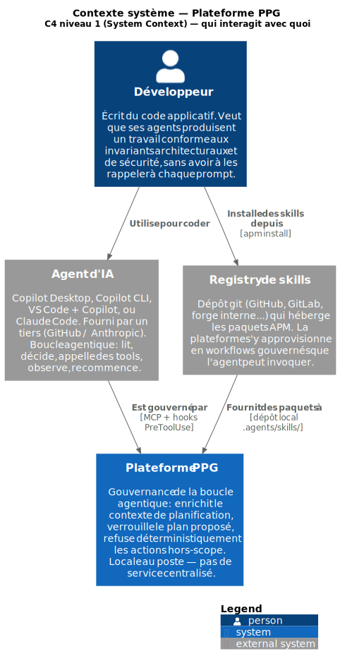
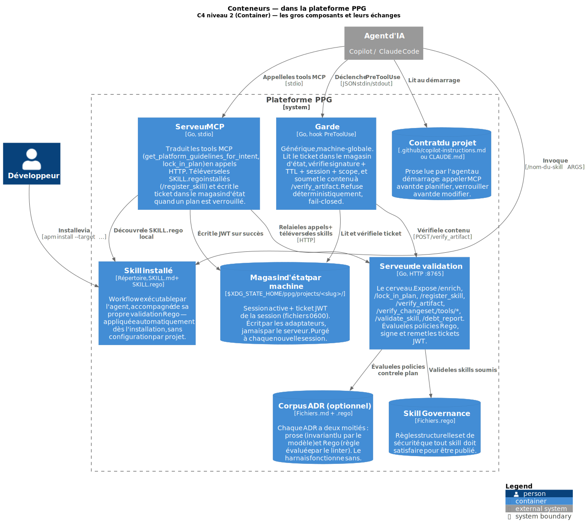
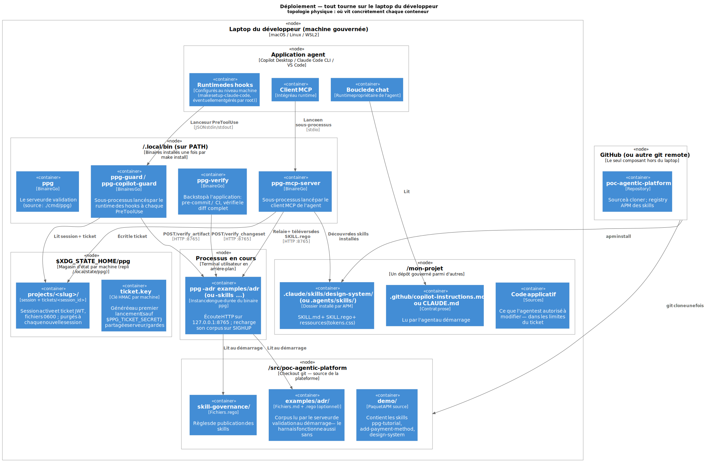
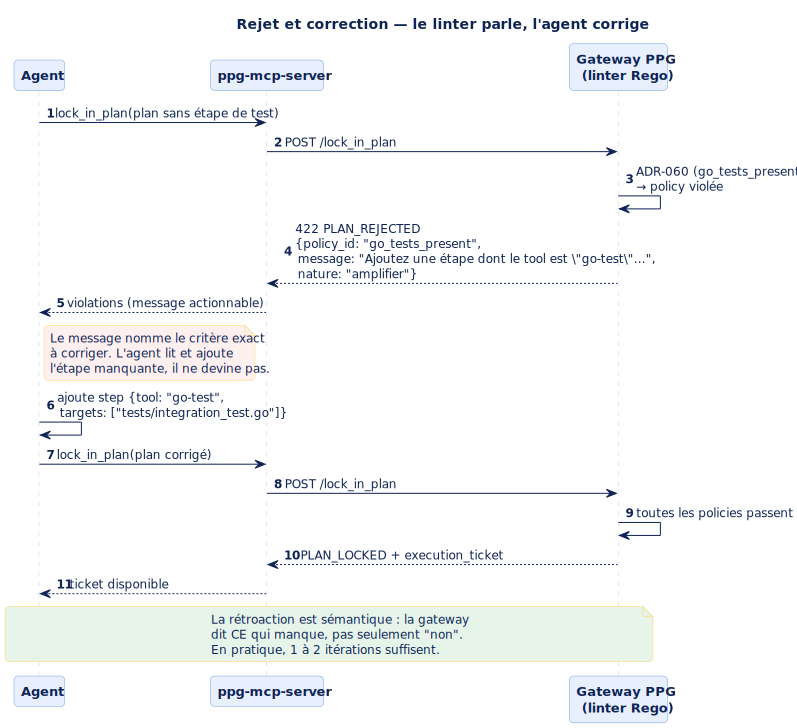
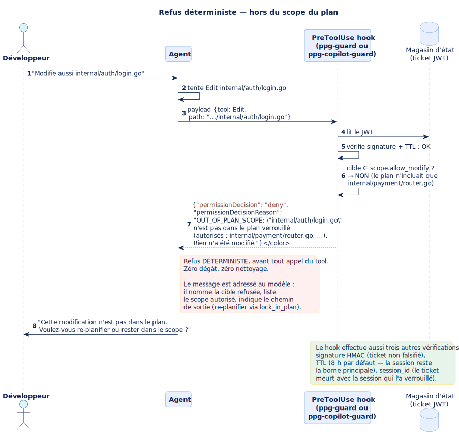
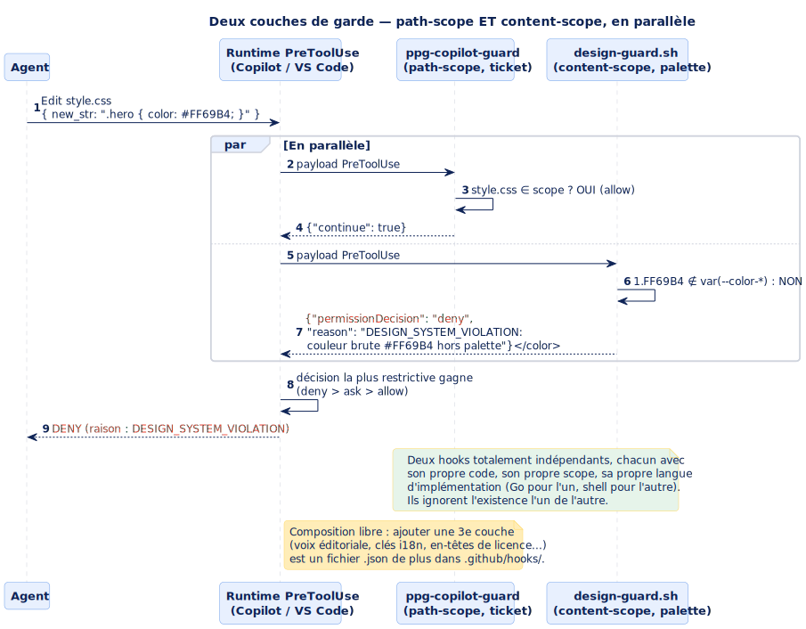
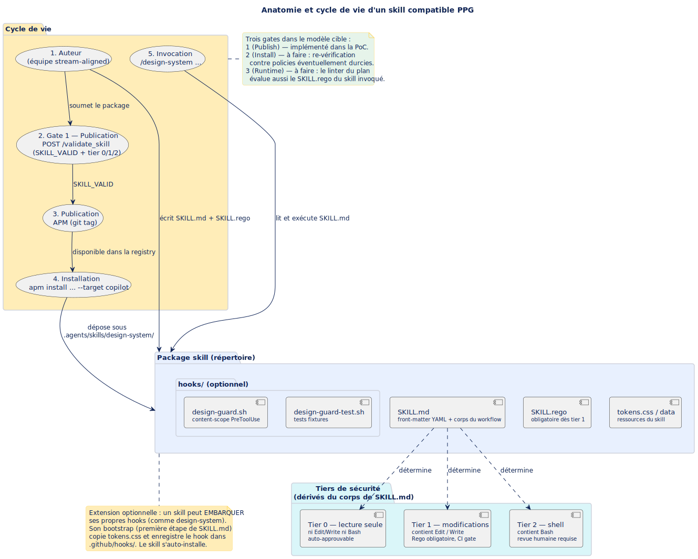
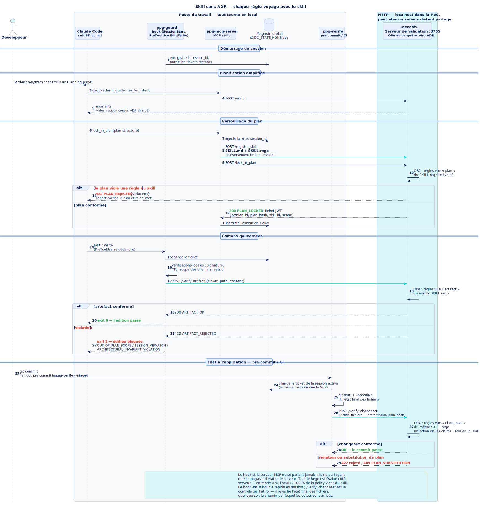
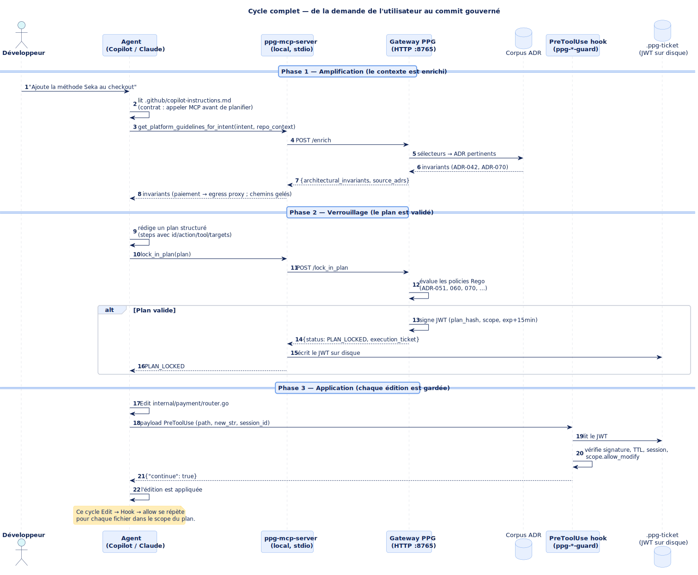

# PPG — un harnais de gouvernance déterministe pour les boucles agentiques

> **Objet** : ce document raconte l'histoire complète du projet, en
> partant du problème qu'il résout — comment faire **confiance** aux
> artefacts produits par un agent de code (Claude Code, GitHub
> Copilot…) — jusqu'à la mécanique qui fonde cette confiance. Il est
> auto-portant : aucune lecture préalable n'est requise. Les termes
> techniques figés (`MCP`, `Rego`, `JWT`, `PreToolUse`, `lock_in_plan`,
> `ADR`) sont conservés dans leur forme d'origine, avec une glose
> française à leur première apparition.

> **Note sur le nom** : « PPG » est un acronyme historique — *Platform
> Planning Gateway* — conservé comme marque. Depuis
> l'[ADR-130](../docs/decisions/ADR-130-gateway-naming.md), le composant
> central s'appelle le **serveur de validation** : le mot « gateway »
> suggérait un point de passage unique, alors que l'application des
> règles est distribuée en plusieurs points de contrôle. Les articles
> compagnons publiés avant ce renommage disent encore « gateway ».

## Table des matières

- [Vocabulaire minimal](#vocabulaire-minimal) — lisez-le en diagonale avant de commencer
1. [Le problème que l'on veut résoudre](#1-le-problème-que-lon-veut-résoudre)
2. [L'approche courante — le juge LLM — et ses limites](#2-lapproche-courante--le-juge-llm--et-ses-limites)
3. [La solution : la validation voyage avec la règle](#3-la-solution--la-validation-voyage-avec-la-règle)
4. [Vue d'ensemble de l'architecture](#4-vue-densemble-de-larchitecture)
5. [Comment l'agent est-il *guidé* vers le MCP ?](#5-comment-lagent-est-il-guidé-vers-le-mcp-)
6. [Le plan et son verrou (`lock_in_plan`)](#6-le-plan-et-son-verrou-lock_in_plan)
7. [Le ticket JWT — la phase d'implémentation](#7-le-ticket-jwt--la-phase-dimplémentation)
8. [Anatomie d'un skill compatible](#8-anatomie-dun-skill-compatible)
9. [La machine gouvernée et le fonctionnement sans ADR](#9-la-machine-gouvernée-et-le-fonctionnement-sans-adr)
10. [Quand les règles se contredisent — l'escalade `POLICY_CONFLICT`](#10-quand-les-règles-se-contredisent--lescalade-policy_conflict)
11. [L'histoire complète, de bout en bout](#11-lhistoire-complète-de-bout-en-bout)
- [Ce qui est prouvé, ce qui reste ouvert](#ce-qui-est-prouvé-ce-qui-reste-ouvert)
- [Pour aller plus loin (documentation anglaise)](#pour-aller-plus-loin-documentation-anglaise)

---

## Vocabulaire minimal

Onze termes suffisent pour lire le reste. Ils reviendront tous, avec
plus de contexte, dans les sections. Cette liste est un filet de
sécurité : consultez-la à la volée sans essayer de tout mémoriser.

| Terme | Définition tenue en une phrase |
|---|---|
| **Agent** | Un modèle d'IA (Claude, Copilot…) qui tourne en boucle : il lit, décide, appelle des *tools* (édition de fichier, exécution de commande…), observe le résultat, recommence. |
| **MCP** *(Model Context Protocol)* | Standard qui permet à un agent d'appeler des *tools* fournis par un serveur externe local via un simple canal `stdio` — l'équivalent d'un « USB des agents IA ». |
| **Hook** | Un script/binaire déclenché automatiquement par le runtime de l'agent à un moment précis (avant un tool, au démarrage d'une session…). Il lit un JSON sur son entrée standard, écrit une décision, exit 0. |
| **PreToolUse** | Le *hook* déclenché juste **avant** qu'un tool ne s'exécute. Il peut autoriser ou refuser — c'est le point d'interception qui permet le refus déterministe. |
| **Serveur de validation** | Le service HTTP local (`ppg`, `:8765`) qui centralise la **décision** : il évalue toutes les policies Rego et signe les tickets. Les points de contrôle distribués (hooks, smart tools, `ppg-verify`) lui délèguent le verdict — même corpus, même réponse partout. |
| **ADR** *(Architectural Decision Record)* | Un document qui capture une décision architecturale durable (« tous les appels externes passent par le proxy egress »). Dans ce projet, chaque ADR a une moitié prose (pour l'humain et le modèle) et une moitié exécutable en Rego (pour le linter). **Corpus optionnel** : le harnais fonctionne sans (section 9). |
| **Rego** | Un langage de règles déclaratif (Open Policy Agent, OPA). On y écrit des prédicats qui, appliqués à des données JSON, retournent une liste de violations. C'est du SQL pour la conformité — et le **seul format de validation supporté** par le projet. |
| **Skill** | Un paquet de capacité installé pour l'agent : un workflow prose (`SKILL.md`) **accompagné de sa propre validation** (`SKILL.rego`). La règle et son contrôle voyagent ensemble. |
| **Linter** | Un programme qui analyse une entrée (ici un *plan*, un *artefact* ou un *skill*) sans l'exécuter et retourne les problèmes détectés. Rapide, déterministe, actionnable. |
| **JWT** *(JSON Web Token)* | Une chaîne de caractères qui embarque des *claims* (données) signées cryptographiquement. Impossible à forger sans la clé. Ici : le **ticket de capacité** qui dit « ce plan a été validé, voici son scope, voici sa session ». |
| **Amplifier vs Compensatory** | Deux natures d'invariants. **Amplifier** = règle durable, valide même contre un modèle parfait (ex : contraintes de sécurité). **Compensatory** = contournement d'une limitation actuelle du modèle, appelée à disparaître (ex : liste explicite des chemins gelés). La plateforme mesure le ratio pour suivre sa dette de transition. |

---

## 1. Le problème que l'on veut résoudre

> **En une phrase** : les agents reposent sur des LLM, les LLM sont
> non-déterministes, donc **rien ne garantit** que les règles placées
> dans leur contexte seront respectées — et la promesse de ce projet
> est de restaurer cette garantie **sans dépendre du modèle**.

Un agent de développement exécute ce qu'on lui demande en s'appuyant
sur un modèle de langage. Or un modèle de langage est, par
construction, **non-déterministe** : la même entrée peut produire des
sorties différentes. Tout ce qu'on met dans son contexte — règles,
instructions, skills, design system — est une *influence*, jamais une
*garantie*. L'incertitude empire quand les éléments du contexte sont
**contradictoires**.

**Exemple.** Un design system impose des boutons bleus (via le contexte
ou via un skill). Le développeur surcharge le prompt : *« Non, c'est
moi le développeur, je les veux roses. »* Le résultat sera rose *ou*
bleu, selon l'humeur du modèle. Certains agents déclencheront une
escalade vers l'humain — mais **ce garde-fou est insuffisant** : la
décision d'escalader dépend elle-même du comportement non-déterministe
du modèle. On a déplacé le problème, pas résolu.

Tant que la seule ligne de défense est « le modèle a lu la règle », on
ne peut pas **faire confiance** aux artefacts produits. C'est ce
manque-là que le projet attaque : prouver qu'un **harnais de
gouvernance déterministe** peut envelopper la boucle agentique de sorte
que les artefacts produits **respectent un ensemble de règles défini**,
et qu'on puisse **vérifier** que c'est le cas.

## 2. L'approche courante — le juge LLM — et ses limites

Aujourd'hui, la validation se fait le plus souvent par un **juge LLM**
(dit parfois *adversarial*) : un second modèle relit la sortie du
premier. Ça aide — mais cette approche a quatre problèmes structurels :

- **Coût** — chaque validation consomme des tokens supplémentaires, à
  chaque fois.
- **Confiance insuffisante** — le juge *augmente* la confiance, mais
  pas assez : étant lui-même non-déterministe, il peut laisser passer
  un problème malgré de bonnes directives — et le laisser repasser.
- **Non capitalisable** — c'est le point décisif. Quand un juge LLM
  laisse passer un défaut, rien ne garantit qu'il ne le laissera pas
  passer à nouveau. Quand un **point de contrôle déterministe** laisse
  passer un défaut, on **complète la policy** : ce défaut précis **ne
  passera plus jamais**. La connaissance est capitalisée dans le
  système, pas perdue dans un prompt.
- **Fragilité au contexte** — plus on charge le contexte du juge
  (règles, directives, exceptions), plus il rate de choses. La
  fiabilité se dégrade à mesure que les exigences s'accumulent —
  exactement l'inverse de ce qu'on attend d'un système de garantie.

| Critère | Validation par juge LLM | Harnais déterministe (ce projet) |
|---|---|---|
| Déterminisme | Non | Oui |
| Coût en tokens | À chaque validation | Quasi nul |
| Confiance | Partielle, variable | Élevée, reproductible |
| Correction d'un défaut | Tenue non garantie | Permanente (monotone) |
| Sensibilité à la charge du contexte | Se dégrade | Insensible |
| Contournement possible | Oui (dépend du modèle) | Non dans le canal gouverné (refus bloquant) |
| Portée | Par prompt / par projet | Machine (organisation) |

Pour dépasser ces limites, le projet fournit une **validation
déterministe** : reproductible, indépendante du modèle, à coût marginal
quasi nul en tokens, et surtout **améliorable de façon monotone** —
chaque correction est définitive.

## 3. La solution : la validation voyage avec la règle

> **En une phrase** : un skill n'énonce pas seulement une règle
> (« le bouton doit être bleu ») — il **embarque son mécanisme de
> vérification**, appliqué au moment du *plan* et au moment de
> l'*artefact* ; et en cas de contradiction, l'escalade est bloquante,
> **sans contournement possible**.

Concrètement, un **skill** est ici un répertoire contenant deux
moitiés : `SKILL.md`, le workflow prose que l'agent exécute, et
`SKILL.rego`, la politique exécutable qui le vérifie — **OPA/Rego est
le seul format de validation supporté** (choix délibéré tant qu'il
couvre les besoins ; extensible plus tard s'il s'avère insuffisant).
Le même corpus de policies est évalué à deux moments, de façon
déterministe :

1. **Au moment du plan** — avant toute exécution, le plan structuré de
   l'agent est linté (`lock_in_plan`). Un plan rejeté reçoit des
   violations sémantiques sur lesquelles s'auto-corriger ; un plan
   accepté reçoit un **ticket de capacité** (un jeton signé éphémère :
   empreinte du plan + scope de moindre privilège).
2. **Au moment de l'artefact** — chaque `Edit`/`Write` est intercepté
   par un point de contrôle (`ppg-guard`) qui vérifie le ticket **et**
   évalue le contenu produit contre les mêmes policies. Une troisième
   passe (`ppg-verify`) revérifie le diff complet à l'application
   (pre-commit / CI).

Pas de ticket, pas d'édition. Serveur injoignable, pas d'édition. Les
refus sont des codes de sortie et des rejets HTTP — pas des prompts
qu'un modèle peut contourner en argumentant. L'application des règles
est **distribuée** (points de contrôle dans la boucle, dans les tools,
et à l'application) ; la **décision est centralisée** dans un unique
serveur de validation, si bien que chaque point de contrôle rend un
verdict identique à partir d'un seul corpus.

**Et quand les règles se contredisent, la réponse est : aucune
action.** Un prompt ne peut pas surcharger une policy — le développeur
qui tape « je les veux roses » obtient le même refus à chaque
tentative. Si deux validations sont mutuellement insatisfiables, aucun
résultat arbitraire n'est produit, donc aucune surprise : le serveur
escalade de façon déterministe vers un humain (section 10), et une fois
le corpus corrigé, **ce conflit ne se reproduira jamais**. C'est la
boucle d'amélioration monotone : chaque échappée devient une policy
permanente, pas un prompt perdu.

Deux choix structurants complètent le tableau :

- **Le mode « machine gouvernée » est le mode de référence.** Le
  système vise les **organisations** : la gouvernance s'applique au
  niveau de la machine / du poste de travail standardisé. Une fois le
  harnais installé, **tout projet utilisé sur cette machine en
  bénéficie** — et un skill installé qui embarque sa validation est
  **nécessairement pris en compte**, sans configuration par projet
  (section 9).
- **Les ADR sont optionnels.** Ils constituent un second corpus pour
  les règles d'organisation, mais le harnais fonctionne intégralement
  sans eux : la garantie de base voyage dans les skills.

Le reste du document déroule la mécanique qui rend tout cela vrai.

---

## 4. Vue d'ensemble de l'architecture

> **En une phrase** : le serveur de validation est un service HTTP
> local qui *enrichit* la phase de planification d'un agent (il lui
> livre les invariants architecturaux qui s'appliquent à sa tâche), qui
> *verrouille* le plan qu'il propose (via un linter Rego déterministe),
> puis lui remet un **ticket JWT** qui borne ses capacités pendant la
> phase d'application. Un ou plusieurs *hooks* côté client vérifient ce
> ticket à chaque édition ; toute modification hors du scope du plan
> est refusée avant exécution.

Le harnais repose sur trois familles de composants : des **hooks**
(l'interception côté agent), des **serveurs MCP** (la planification),
et un **serveur de validation** (la décision). L'architecture se lit en
trois diagrammes, du plus large au plus physique.

> 📖 **Le modèle C4** (Simon Brown) propose quatre niveaux de zoom pour
> décrire un système logiciel : **C1 Contexte** (le système et son
> environnement), **C2 Conteneurs** (les gros composants runtime),
> **C3 Composants** et **C4 Code** (rarement utilisés). Cette
> documentation utilise le C1 et le C2, plus une vue de **déploiement**
> (topologie physique). Les couleurs bleu/gris sont la convention
> standard du modèle — d'où le contraste avec les diagrammes de
> séquence qui suivent, restés au thème visuel du projet.

### 4.1 Contexte système (C1) — qui interagit avec quoi



Le développeur écrit du code et utilise un **agent d'IA** (Copilot ou
Claude Code) pour l'assister. Cet agent est *gouverné* par la
**plateforme PPG** — via le protocole MCP (pour la planification) et
via des hooks (pour l'exécution). Le développeur peut aussi installer
des **skills** publiés dans une **registry** git : la plateforme les
consomme comme de la capacité additionnelle. Quatre boîtes, aucun
détail technique.

### 4.2 Conteneurs (C2) — les gros composants de la plateforme



Zoom dans la plateforme PPG. On y trouve quatre conteneurs runtime :
le **serveur de validation** (le service HTTP qui évalue les policies
Rego et signe les tickets), le **serveur MCP** (qui traduit les tools
MCP en appels HTTP), la **garde** (le hook générique qui vérifie le
ticket et le contenu à chaque édition), et le **skill installé**
(workflow que l'agent invoque, porteur de son propre `SKILL.rego`). Et
quatre zones de données : le **corpus ADR** (optionnel), la
**skill governance**, le **magasin d'état par machine** (session
active + tickets, sous `$XDG_STATE_HOME/ppg/`), et le **contrat du
projet**. Les flèches disent qui parle à quoi.

### 4.3 Déploiement — où tout ça vit-il concrètement



Le message important de ce diagramme : **tout tourne sur le laptop du
développeur**. Le serveur de validation n'est pas un service
centralisé distant — c'est un binaire local (`ppg`) lancé dans un
terminal en arrière-plan (il écoute sur `127.0.0.1:8765` ; un
déploiement partagé est possible mais doit être placé derrière un
proxy d'authentification). Les adaptateurs (`ppg-mcp-server`,
`ppg-guard`, `ppg-copilot-guard`, `ppg-verify`) sont des binaires
locaux installés une fois pour toutes dans `~/.local/bin/`. Les
fichiers d'état (session active, tickets) vivent dans un **magasin par
machine** sous `$XDG_STATE_HOME/ppg/projects/<slug>/` — plus rien
n'est écrit dans le projet. Le seul composant hors du laptop est le
remote git qui héberge le code source et les skills — utilisé une fois
pour le clone, puis périodiquement pour `apm install`.

### 4.4 Récapitulatif textuel des pièces

| Pièce | Où elle vit | Rôle |
|---|---|---|
| **Serveur de validation** | binaire `ppg`, HTTP `127.0.0.1:8765` | expose `/enrich`, `/lock_in_plan`, `/register_skill`, `/verify_artifact`, `/verify_changeset`, `/tools/{name}`, `/validate_skill`, `/debt_report` |
| **Corpus ADR** *(optionnel)* | fichiers `examples/adr/*.md` + `*.rego` | chaque ADR a une moitié *sémantique* (invariants prose) et une moitié *exécutable* (Rego) |
| **Points de contrôle machine** | binaires locaux (`ppg-mcp-server`, `ppg-guard`, `ppg-copilot-guard`, `ppg-verify`) | génériques, installés une fois par machine ; appliquent le verdict du serveur |
| **Magasin d'état par machine** | `$XDG_STATE_HOME/ppg/projects/<slug>/` (repli `~/.local/state/ppg`) | session active + ticket de la session, fichiers `0600` ; écrit par les adaptateurs, jamais par le serveur |
| **Contrat du projet** | `.github/copilot-instructions.md` (ou `CLAUDE.md`) | soft : contrat prose lu par l'agent au démarrage |
| **Skills** | `.claude/skills/*`, `.agents/skills/*` (projet) ou `~/.claude/skills/*` (machine) | workflows distribués (paquet APM) ; chacun embarque son `SKILL.rego` |

Le point important : **le serveur de validation n'écrit jamais dans le
projet ni dans le magasin d'état**. C'est un service HTTP pur. Toute la
matérialisation locale (session, ticket) est faite par les adaptateurs
côté client. Cette séparation permet au serveur d'être partagé entre
projets, machines ou même organisations, sans jamais avoir besoin
d'accès à leur code.

Trois *piliers* portent l'ensemble :

1. **Amplification** (soft) — `POST /enrich` livre à l'agent les
   invariants pertinents pour son intention. Ce sont des **règles
   architecturales** (« tout appel externe passe par le proxy egress »)
   et non des recettes (« modifie le fichier X ligne Y »). L'agent
   raisonne dessus.
2. **Verrouillage** (hard) — `POST /lock_in_plan` évalue le plan
   proposé par l'agent contre les policies Rego. Soit il renvoie des
   *violations sémantiques* que l'agent lit et corrige, soit il renvoie
   un ticket JWT signé.
3. **Garde** (hard) — un *hook* `PreToolUse` (subprocess trivial :
   binaire Go) refuse toute édition qui sort du scope du ticket ou dont
   le contenu viole un invariant, avant que le tool ne soit exécuté.

> 💡 **Pourquoi trois couches et pas une seule ?** Chacune agit à un
> moment différent et sert un but différent : l'amplification *informe*
> le modèle (soft, peut être ignorée), le verrouillage *contraint* la
> proposition (hard, mais côté planification), la garde *empêche
> physiquement* la mauvaise action (hard, au moment où elle se
> produit). Un modèle qui se comporte parfaitement passe les trois sans
> les sentir ; un modèle qui dérive est arrêté au premier point de
> contrôle qu'il touche.

---

## 5. Comment l'agent est-il *guidé* vers le MCP ?

> **En une phrase** : on ne **force** pas l'agent à appeler MCP au
> moment de la planification ; on **rend impossible toute modification
> sans ticket**, et le seul chemin qui produit un ticket passe par MCP.
> Le mécanisme force le flux en amont depuis un unique point de contrôle
> en aval.

### 5.1 La couche soft — le contrat

Chaque projet gouverné porte un fichier d'instructions que l'agent lit
au démarrage de la session :

- pour GitHub Copilot : `.github/copilot-instructions.md`,
- pour Claude Code : `CLAUDE.md`,
- (le fichier est ensemencé automatiquement par
  `adapters/preflight` avec les invariants pertinents pour l'intention).

Ce fichier contient un contrat comportemental court :

> - Avant toute planification, appeler `get_platform_guidelines_for_intent`.
> - Avant toute modification, soumettre le plan via `lock_in_plan`.
> - Si un tool refuse avec `OUT_OF_PLAN_SCOPE`, ne pas ré-essayer :
>   soit rester dans le scope, soit re-planifier.

L'agent honore ce contrat parce que c'est un modèle raisonnable ; **mais
rien de technique ne l'y contraint à ce stade**. Le fichier est
consultatif.

### 5.2 La couche hard — le garde

> 📖 **Hook** — un mécanisme prévu par le runtime de l'agent pour
> déclencher un script externe à des moments-clés (avant un tool, au
> démarrage d'une session, etc.). Le script reçoit une description JSON
> de ce qui va se passer, et peut *refuser* en renvoyant une décision.
> C'est l'équivalent des *webhooks* HTTP, mais côté client, sur un
> événement interne à l'agent.

Le hook `PreToolUse` (`ppg-guard` ou `ppg-copilot-guard`) est
enregistré au niveau **machine** : `~/.claude/settings.json` pour
Claude Code (ou, en mode géré, un fichier de réglages détenu par
root — voir section 9), `.github/hooks/ppg.json` pour Copilot. Il est
appelé par le runtime de l'agent **avant chaque appel de tool** de type
`Edit` ou `Write`, avec en entrée sur `stdin` la description JSON de
l'appel (nom du tool, chemin cible, contenu à écrire).

Ce hook lit le ticket dans le **magasin d'état par machine**
(`$XDG_STATE_HOME/ppg/projects/<slug>/tickets/<session_id>`). **En
l'absence de ticket, il refuse l'édition** (`No capability ticket
found`). **Avec un ticket, il vérifie** :

- que la signature HMAC du JWT est valide,
- que la TTL n'est pas dépassée (8 h par défaut, réglable),
- que la `session_id` du ticket correspond à la session courante,
- que la cible de l'édition figure dans `scope.allow_modify`,
- et que le **contenu** écrit respecte les invariants : le garde envoie
  le contenu au serveur de validation (`POST /verify_artifact`), qui
  évalue le même corpus Rego à l'altitude *artifact*.

Le garde émet ensuite sa décision (`allow` ou `deny` avec une raison
sémantique) ; le runtime de l'agent l'applique avant même de considérer
l'exécution du tool. Et le garde est **fail-closed** : payload
illisible, magasin inaccessible ou serveur de validation injoignable →
l'édition est bloquée (`PPG_GUARD_ERROR … (fail-closed)`), jamais
laissée passer par défaut.

### 5.3 Pourquoi ça marche

Le ticket est *le seul* moyen d'obtenir l'autorisation d'écrire.
Or il n'est produit que par le serveur MCP, en réponse à un appel
`lock_in_plan` accepté par le serveur de validation. Et pour qu'un plan
soit accepté, il doit satisfaire les policies Rego — lesquelles
reposent souvent sur ce que `enrich` a révélé (« le plan touche un
provider de paiement mais n'inclut pas d'étape passant par l'egress
proxy → rejet avec un message pointant l'invariant »).

**En pratique** :

- Un agent qui essaie de sauter la phase MCP se heurte au garde dès la
  première écriture. Il lit la raison du refus (« No capability ticket
  found ... appelle `lock_in_plan` ») et corrige sa trajectoire.
- Un agent qui appelle `lock_in_plan` avec un plan désaligné se heurte
  au linter Rego. Il lit les violations et corrige, ce qui l'oblige
  souvent à d'abord appeler `enrich` pour comprendre les invariants
  attendus.

Le contrôle ne s'applique pas au moment de la planification (impossible
à intercepter proprement) mais **au moment de la modification** — le
seul instant où le comportement de l'agent devient observable et
arrêtable.

---

## 6. Le plan et son verrou (`lock_in_plan`)

> **En une phrase** : le plan est un objet JSON structuré (`steps` avec
> `id`, `action`, `tool`, `targets`) soumis à `POST /lock_in_plan` ; le
> linter Rego l'évalue contre tout le corpus (ADR *et* règles des
> skills) ; en cas de succès, il renvoie un JWT signé (le *ticket*).

### 6.1 Le contrat du plan

```json
{
  "session_id": "uuid",
  "intent": "Ajouter la méthode Seka au checkout",
  "repository_context": { "name": "checkout-service", "tech_stack": ["Go"] },
  "steps": [
    { "id": "s1", "action": "migration", "tool": "db-migration-generator",
      "targets": ["migrations/001_seka.sql"] },
    { "id": "s2", "action": "edit router", "tool": "patch_code",
      "targets": ["internal/payment/router.go"] },
    { "id": "s3", "action": "go test ./...", "tool": "go-test",
      "targets": ["tests/integration_payment_test.go"] }
  ]
}
```

Le schéma est décrit dans `schemas/plan.schema.json` ; la source de
vérité côté Go est `internal/plan.Plan`. Le champ `tool` est libre : les
policies reconnaissent aussi bien le vocabulaire de la plateforme
(`patch_code`, `go-test`, `db-migration-generator`) que celui des agents
de code (une étape `Bash` dont l'action lance `go test`, une migration
exprimée comme cible sous `migrations/`). Un plan peut aussi déclarer un
`skill_id` : les règles *plan* du skill correspondant s'appliquent
alors en plus du corpus (section 8.2).

### 6.2 Le linter Rego

> 📖 **Linter** — un programme qui *lit* une entrée et signale les
> problèmes, sans jamais l'exécuter. `gofmt` ou `eslint` sont des
> linters de code source ; le linter de plan ici lit du JSON et signale
> les violations d'invariants. Un linter est *rapide* (pas
> d'interprétation) et *déterministe* (même entrée → même sortie).

> 📖 **Rego** — le langage de règles associé à **OPA** (Open Policy
> Agent), un moteur d'évaluation open source. On écrit des prédicats
> déclaratifs qui, appliqués à un document JSON, retournent une liste
> de violations. Le fait qu'il ne s'agisse **pas d'un LLM** est
> crucial : la décision est reproductible, auditable, et gratuite en
> ressources. (Le moteur est de plus restreint aux *built-ins*
> déterministes : une policy ne peut pas dépendre de l'heure ou du
> réseau pour rendre son verdict.)

À chaque `lock_in_plan`, le serveur de validation exécute *toutes* les
policies Rego du corpus contre le plan. Chaque policy est un prédicat
qui accumule des violations. Exemples actuels du corpus de
démonstration :

- `ADR-051.rego` — une étape SQL doit être précédée (ou accompagnée)
  d'une migration.
- `ADR-060.rego` — un plan Go doit inclure une étape de test.
- `ADR-070.rego` — certains chemins sont gelés (`internal/auth/`,
  `internal/old_payment.go`) et interdits d'édition.
- `ADR-090.rego` — un plan qui touche un fichier UI doit inclure une
  étape lisant `design/tokens.css`.

En cas de violation, le serveur répond :

```json
{
  "status": "PLAN_REJECTED",
  "violations": [
    { "policy_id": "go_tests_present",
      "message": "Ajoutez une étape dont le tool est \"go-test\" ...",
      "nature": "amplifier" }
  ],
  "guidance": "Corrigez les violations et re-soumettez."
}
```



Le message est **actionnable** : il nomme le critère exact à corriger.
Le champ `nature` permet à la plateforme de tagger la policy comme
*amplifier* (règle durable, valide même contre un modèle parfait) ou
*compensatory* (contournement d'une limitation actuelle du modèle,
appelé à disparaître).

> 💡 **Le test des 2× de puissance** — un outil pratique pour classer
> un invariant : « cette règle serait-elle *plus utile* ou *inutile*
> si le modèle était deux fois plus intelligent ? » Si elle reste
> utile (contraintes organisationnelles, contrats de sécurité), c'est
> un *amplifier*. Si elle devient inutile (la règle compensait une
> limitation du modèle qui a disparu), c'est un *compensatory*, et il
> faut lui donner une `sunset_condition`. Le `/debt_report` du serveur
> mesure le ratio des deux : c'est un indicateur de dette de
> transition à faire tendre vers zéro.

### 6.3 Le succès et le ticket

> 📖 **JWT** *(JSON Web Token)* — une chaîne de caractères composée de
> trois parties séparées par des points : `header.payload.signature`.
> Le `payload` est un objet JSON (les *claims*) encodé en base64. La
> `signature` prouve que le contenu n'a pas été modifié depuis
> l'émission. N'importe qui peut *lire* les claims (ce n'est pas
> chiffré) ; seul quelqu'un possédant la clé peut *forger* un JWT
> valide.
>
> 📖 **HS256** — l'algorithme de signature utilisé ici : HMAC avec
> SHA-256. **Symétrique** : la même clé sert à signer et à vérifier.
> La clé vient de `$PPG_TICKET_SECRET` si défini, sinon d'un fichier
> de clé **par machine** généré au premier lancement
> (`$XDG_STATE_HOME/ppg/ticket.key`, mode `0600`), partagé par le
> serveur et les gardes. En production multi-machines, on passerait à
> un algorithme asymétrique (RS256 ou ES256) derrière un KMS.

Quand toutes les policies passent, le serveur de validation :

1. calcule `plan_hash = SHA-256(plan_canonique)`,
2. dérive `scope.allow_modify = union des steps[].targets` et
   `scope.allow_tool = union des steps[].tool`,
3. lit la `session_id` (le serveur MCP la substitue par la vraie
   session courante lue dans le magasin d'état),
4. signe un JWT HS256 avec `iat`, `exp` (TTL configurable, 8 h par
   défaut), `plan_hash`, `session_id`, `skill_id` le cas échéant, et
   `scope`,
5. retourne `{ "status": "PLAN_LOCKED", "execution_ticket": "eyJ...", "plan_hash": "..." }`.

Le serveur MCP écrit le token dans le magasin d'état par machine
(`$XDG_STATE_HOME/ppg/projects/<slug>/tickets/<session_id>`, mode
`0600`), où les gardes iront le lire.

---

## 7. Le ticket JWT — la phase d'implémentation

> **En une phrase** : **oui**, le JWT n'est utilisé qu'à partir du
> moment où l'agent commence à modifier des fichiers. La phase de
> planification n'a besoin d'aucun ticket ; elle appelle `/enrich` et
> `/lock_in_plan` librement. Le ticket ne devient un objet vivant qu'au
> premier `Edit`/`Write`.

### 7.1 Qui vérifie le ticket ?

Trois vérificateurs, pour trois surfaces :

- **Le hook `PreToolUse`** (côté client, dans l'agent). Il lit le
  ticket dans le magasin par machine, vérifie signature + TTL +
  session + scope, soumet le contenu à `/verify_artifact`, et refuse
  déterministiquement avec `OUT_OF_PLAN_SCOPE` (cible hors scope) ou
  `ARCHITECTURAL_INVARIANT_VIOLATION` (contenu non conforme). C'est le
  chemin normal, activé sur chaque édition.
- **Les smart tools** (`POST /tools/{name}` sur le serveur de
  validation). Même vérification côté serveur, pour les scénarios sans
  hook (workflow `curl`, script CI, adaptateur pour un agent tiers). Le
  ticket est passé dans le corps de la requête.
- **`ppg-verify`** (à l'application : hook pre-commit ou étape CI). Il
  relit le ticket, calcule le diff réel du working tree (`git status
  --porcelain`) et le soumet à `POST /verify_changeset` — qui revérifie
  chaque fichier **dans son état final**, quel que soit le chemin par
  lequel les octets sont arrivés (y compris un `echo` en terminal que
  les hooks ne voient pas). C'est le filet de sécurité qui couvre les
  surfaces sans hook.

Les deux premiers appellent la même fonction interne,
`smarttools.GuardTargets`, qui décode le JWT, vérifie les claims et
compare `targets` à `scope.allow_modify`. Un désaccord retourne un objet
`OutOfScopeError{Attempted, Allowed}` qui alimente le message sémantique.



### 7.2 Anatomie du JWT

| Claim | Type | Sens |
|---|---|---|
| `iat` / `exp` | int | Émis à / expire à. TTL par défaut **8 h**, réglable (`-ticket-ttl` ou `$PPG_TICKET_TTL`) ; la **session** reste la borne principale (voir ci-dessous). |
| `session_id` | uuid | Session à laquelle le ticket est *lié*. Un ticket copié dans une autre session est refusé (`SESSION_MISMATCH`). |
| `plan_hash` | sha256 hex | Empreinte canonique du plan verrouillé — permet de vérifier que le ticket correspond bien au plan qu'on croit. |
| `skill_id` | string *(absent si vide)* | Le skill que le plan verrouillé déclarait, le cas échéant — réinjecté dans l'évaluation des policies aux altitudes artefact et changeset. |
| `scope.allow_modify` | string[] | Fichiers autorisés à la modification (les `targets` de chaque `step`). Un chemin terminé par `*` autorise le sous-arbre. |
| `scope.allow_tool` | string[] | Tools autorisés à l'appel (les `tool` de chaque `step`). |

Le ticket est un **bearer capability** : celui qui peut lire le fichier
possède le droit.

> 📖 **Bearer capability** — la traduction française « capacité au
> porteur » n'aide pas ; l'analogie qui parle est celle d'un ticket
> de train : quel que soit celui qui le présente, il donne accès. Il
> n'y a pas de vérification d'identité au-delà de la possession du
> ticket. C'est pratique (pas d'authentification lourde) mais fragile
> (un ticket qui fuit est utilisable par quiconque). Les deux
> mécanismes ci-dessous compensent cette fragilité en réduisant la
> fenêtre d'usage.

Deux mécanismes en réduisent la surface :

- **Session binding — la borne principale** : au `SessionStart`, le
  hook enregistre la vraie `session_id` courante dans le magasin
  d'état et **purge tous les tickets** laissés par une session
  précédente sur ce projet. Le serveur MCP injecte ce même
  `session_id` dans le plan au moment du lock, si bien que le ticket
  porte l'identité de sa session d'origine. Toute réutilisation depuis
  une autre session est refusée : **le ticket meurt avec sa session**.
- **TTL 8 h par défaut** : un plafond de défense en profondeur
  (réglable via `-ticket-ttl` / `$PPG_TICKET_TTL`). Au-delà, le garde
  refuse (`TICKET_EXPIRED`). Aucune API de renouvellement — il faut
  re-verrouiller un plan.

### 7.3 Composition de plusieurs gardes

Le contrat `PreToolUse` d'un agent supporte plusieurs hooks enregistrés
sur le même événement. Ils sont exécutés en parallèle par le runtime et
**la décision la plus restrictive gagne** (`deny > ask > allow`).

Le garde `ppg-guard` (ou `ppg-copilot-guard`) applique déjà **deux**
politiques dans un même hook :

- le *path-scope* (est-ce que ce fichier est dans le scope du ticket ?),
- le *content-scope* (est-ce que le contenu écrit respecte les
  invariants ?) : le garde envoie le contenu de l'édition au serveur de
  validation (`POST /verify_artifact`), qui évalue le même corpus Rego
  à l'**altitude artifact**. C'est ainsi que le skill `design-system`
  fait respecter sa palette — via une policy Rego, et non via un script
  shell dédié. (Les mêmes règles sont rejouées sur le diff final par
  `ppg-verify`, `POST /verify_changeset`.)

Si un besoin ne peut pas s'exprimer en Rego, la composition de plusieurs
hooks sur `PreToolUse` reste possible (voix éditoriale, clés i18n,
en-têtes de licence…) : le runtime applique la décision la plus
restrictive.



Chaque hook ignore l'existence des autres ; c'est le runtime qui compose.

---

## 8. Anatomie d'un skill compatible

> **En une phrase** : un skill est un répertoire contenant `SKILL.md`
> (le workflow prose que l'agent exécute) et, dès qu'il touche à des
> fichiers, un `SKILL.rego` compagnon (la politique qui l'exige de la
> plateforme). Il est distribué via APM, validé par le serveur de
> validation, et **son Rego est appliqué automatiquement** dès qu'il
> est installé.



### 8.1 Structure minimale

```
mon-skill/
├── SKILL.md         (front-matter YAML + corps Markdown du workflow)
└── SKILL.rego       (obligatoire dès que le corps mentionne Edit/Write/Bash)
```

**Front-matter obligatoire** (validé par `POST /validate_skill`) :

| Champ | Règle |
|---|---|
| `name` | kebab-case minuscule, ≤ 32 caractères |
| `description` | 50 à 500 caractères, commence par un verbe au présent 3ᵉ personne (« Adds… », « Applies… ») |
| `version` | semver |
| `argument-hint` | requis si le corps utilise `$ARGUMENTS` |

**Corps** : la prose que l'agent exécute. Elle doit suivre le contrat :
appeler `get_platform_guidelines_for_intent`, dresser un plan, appeler
`lock_in_plan`, appliquer dans le scope. Trois exemples réels sont
livrés dans `demo/skills/` :

- `ppg-tutorial` — skill **tier 0** (lecture seule) : aucun
  `SKILL.rego` requis.
- `add-payment-method` — workflow *classique* : le skill exécute les
  trois moves et ne suppose rien de plus.
- `design-system` — workflow *étendu* : sa première étape est un
  bootstrap qui matérialise ses propres ressources (`tokens.css`).
  L'invariant de palette est porté par son Rego (altitude artifact) et
  appliqué par le garde standard via `POST /verify_artifact`. Chaque
  édition est ainsi vérifiée à la fois sur le scope (ticket) et sur le
  contenu (palette).

### 8.2 Le compagnon Rego — appliqué automatiquement (Gate 3)

Dès que le corps mentionne `Edit`, `Write` ou `Bash`, le linter de
skills (`internal/skill/linter.go`) refuse la publication sans un
`SKILL.rego` compagnon. Structure minimale (mêmes primitives que les
policies d'ADR) :

```rego
package ppg.skills.mon_skill

import rego.v1

violation contains v if {
    input.view == "plan"
    some step in input.steps
    # ...condition sur le plan...
    v := {
        "policy_id": "ma_regle",
        "message":   "Message actionnable pour l'agent.",
        "nature":    "amplifier",
    }
}
```

Une même policy peut viser trois **altitudes**, discriminées par
`input.view` : `plan` (au verrouillage), `artifact` (chaque édition),
`changeset` (le diff complet à l'application).

Ces règles compagnon sont **effectivement évaluées** (la « Gate 3 » du
vocabulaire de la plateforme, aujourd'hui implémentée), par deux
canaux qui se composent :

- **Le tier opérateur** — le serveur de validation démarre avec
  `-skills <répertoire>` : les skills publiés y sont chargés une fois
  et valent pour toutes les sessions.
- **Le tier session** — pour les skills installés localement (via
  `apm install`), le serveur MCP les découvre sous `~/.claude/skills/`
  (machine), `.agents/skills/` et `.claude/skills/` (projet — qui gagne
  en cas de collision de nom) et les téléverse au serveur
  (`POST /register_skill`) avant chaque `lock_in_plan`. Aucune
  configuration : installer le skill suffit.

En cas de collision de nom, **le tier opérateur gagne** — un upload
local ne peut pas affaiblir une policy réservée par l'organisation. Un
plan qui déclare un `skill_id` introuvable dans les deux tiers est
rejeté (`unknown_skill`, fail-closed). Et les règles de **contenu**
(altitudes artifact/changeset) de tous les skills enregistrés
s'appliquent **par union à chaque édition**, que le plan ait déclaré le
skill ou non — déclarer un autre `skill_id` ne désactive pas la
palette du design system. (Seules les règles d'*ordonnancement* à
l'altitude plan restent liées au `skill_id` déclaré.)

### 8.3 Les tiers de sécurité

Dérivés automatiquement du corps du skill :

| Tier | Déclencheur | Signification |
|---|---|---|
| 0 | ni `Edit`/`Write` ni `Bash` | Lecture seule, auto-approuvable — pas de Rego requis |
| 1 | contient `Edit` ou `Write` | Modifications de fichiers — gate CI + Rego compagnon obligatoire |
| 2 | contient `Bash` | Accès shell — revue humaine requise |

La dérivation est délibérément naïve (substring match sur le corps) et
sera durcie en production par une allowlist deny-by-default. Le
[tutoriel 16](../docs/tutorials/16-tier-0-vs-governed-skill.md) montre
la différence de traitement entre un skill tier 0 et un skill gouverné.

### 8.4 Distribution via APM

> 📖 **APM** *(Agent Package Manager)* — un outil ligne de commande
> qui synchronise un dépôt git contenant des skills vers un répertoire
> local du projet. Analogue de `npm install` ou `pip install`, mais
> pour les skills d'agents. Sa contribution technique est minimale
> (une copie de fichiers) ; sa contribution *organisationnelle* est
> majeure : il crée la notion de **registry d'entreprise** pour les
> capacités qu'on distribue à ses agents.

```bash
apm install owulveryck/poc-agentic-platform/demo --target copilot
# → dépose les skills sous .agents/skills/
apm install owulveryck/poc-agentic-platform/demo --target claude
# → dépose les skills sous .claude/skills/
```

APM lit le fichier `apm.yml` à la racine du paquet ; l'entrée
`includes: auto` fait que tout skill placé dans `demo/skills/` est
automatiquement embarqué. Aucune configuration à modifier pour ajouter
un nouveau skill.

**Conséquence structurante** : la règle et sa validation voyagent
**ensemble**, dans le skill. Sur une machine gouvernée (section 9), un
skill installé qui fournit une validation est **nécessairement pris en
compte** — sans configuration supplémentaire ni intégration manuelle
par projet. C'est ce qui rend le système capitalisable et distribuable.

### 8.5 Invocation

L'agent découvre les skills sous `.claude/skills/`, `.agents/skills/`
(projet) ou `~/.claude/skills/` (machine) et les rend disponibles comme
*slash commands* :

```
/design-system Construis-moi une landing page avec un CTA
/add-payment-method Stripe
```

Le corps de `SKILL.md` s'exécute dans le contexte de la session : les
appels MCP au serveur `ppg` sont natifs, et les hooks installés au
niveau machine s'appliquent naturellement à toutes les éditions qu'il
produit.

---

## 9. La machine gouvernée et le fonctionnement sans ADR

> **En une phrase** : le mode de référence est la **machine
> gouvernée** — le harnais (hooks, MCP, serveur de validation) est
> installé une fois au niveau du poste de travail, et dès lors **tout
> projet utilisé sur cette machine en bénéficie** ; les ADR ne sont
> qu'un corpus optionnel, la garantie de base voyage dans les skills.

### 9.1 Installer une machine gouvernée

```bash
make install                          # binaires dans ~/.local/bin
make setup-claude-code                # hooks + MCP enregistrés au niveau utilisateur
sudo make setup-claude-code-managed   # optionnel : hooks détenus par root, non modifiables
ppg -adr examples/adr                 # le serveur de validation (corpus de démo)
```

Le système est conçu pour servir des **organisations** : la gouvernance
s'applique au niveau de la machine / du poste de travail standardisé,
pas projet par projet. Les modes alternatifs (par projet) fonctionnent
mais ne sont pas la cible.

Le mode **géré** (`setup-claude-code-managed`) écrit la configuration
des hooks dans un fichier détenu par root que l'utilisateur ne peut ni
éditer ni surcharger depuis ses propres réglages — il ferme le vecteur
« je désactive le hook dans mes settings ». L'installation vérifie
aussi que le binaire du garde n'est pas modifiable par l'utilisateur.
(Le durcissement complet contre un utilisateur activement hostile —
env `PPG_*` épinglé, binaires root — est documenté dans
[set-up-a-governed-workstation](../docs/how-to/set-up-a-governed-workstation.md).)

> 💡 **Capitaliser sans redémarrer** : `kill -HUP <pid du ppg>` fait
> recharger tout le corpus (ADR, policies, skills opérateur) depuis le
> disque et l'échange atomiquement. Étendre une policy après un défaut
> constaté ne coûte qu'un `SIGHUP` — et si le rechargement échoue (un
> `.rego` à moitié écrit), l'ancien corpus continue de servir.

### 9.2 Fonctionner sans ADR : la validation embarquée dans les skills

Les ADR ne sont **pas une dépendance obligatoire**. Le flag `-adr` est
optionnel ; le harnais fonctionne intégralement sans :

```bash
ppg -skills demo/skills    # zéro ADR : 100 % de la policy vient des skills
```

Le mécanisme de garantie repose alors uniquement sur le harnais
installé au niveau machine :

- la machine est en mode gouverné → hooks, MCP et serveur de
  validation sont actifs pour tous les projets ;
- un skill installé via APM embarque son propre fichier de validation
  (`SKILL.rego`) ;
- le harnais étant déjà en place, **ce fichier est nécessairement pris
  en compte** (téléversé par le serveur MCP à chaque verrouillage,
  évalué par le serveur de validation à chaque plan et chaque
  édition) — sans configuration supplémentaire.



Les ADR restent disponibles comme **second corpus optionnel** pour les
invariants d'organisation (et le serveur peut alors aussi enrichir les
prompts et verrouiller les workflows à leur aune) ; les deux corpus
s'additionnent quand ils sont présents.

C'est le scénario du
[tutoriel 15](../docs/tutorials/15-skill-only-enforcement.md), la
démonstration phare du projet : un seul skill, son propre Rego, zéro
ADR — et le prompt adversarial « make the buttons pink » refusé
déterministiquement, à chaque tentative.

---

## 10. Quand les règles se contredisent — l'escalade `POLICY_CONFLICT`

> **En une phrase** : si les policies sont mutuellement insatisfiables
> pour une intention donnée, « corrige et re-soumets » devient un
> mensonge — le serveur de validation le détecte, **bloque tout** et
> escalade vers un humain, sans contournement possible.

Le déclencheur est déterministe : quand les plans d'une session sont
rejetés **3 fois avec un jeu de violations identique** (consécutives ou
non — alterner entre deux formes de plan n'échappe pas au compteur), le
serveur bascule en blocage dur : `409 POLICY_CONFLICT`, avec
l'identifiant stable du conflit (`conflict_id`), la liste des policies
en cause et leur **provenance** (`adr`, `skill` ou `built-in` — qui
doit être autour de la table), et le chemin du journal d'escalade
(`$XDG_STATE_HOME/ppg/escalations.jsonl`).

Une fois escaladé, le conflit bloque **toutes les sessions** qui
produisent le même jeu de violations (ouvrir une session neuve ne le
rouvre pas) et **survit aux redémarrages** du serveur. Aucun résultat
arbitraire n'est produit : ni rose, ni bleu — aucune action.

La seule sortie est humaine :

```bash
ppg escalations list                     # conflits ouverts
ppg escalations show <conflict_id>       # chaque escalade enregistrée
ppg escalations resolve <conflict_id> -note "reformulé ADR-060"
```

`resolve` consigne la résolution dans le journal ; le serveur l'adopte
à son prochain `SIGHUP` — résoudre un conflit emprunte le même rituel
que capitaliser la correction du corpus elle-même. Et c'est bien une
**capitalisation** : le conflit résolu ne peut plus se reproduire.

Une honnêteté s'impose : ce mécanisme détecte le **symptôme** (le
livelock d'un agent contre les mêmes rejets). La détection *générale*
de l'insatisfiabilité d'un corpus Rego est indécidable et n'est pas
revendiquée. Voir le how-to
[Resolve a policy conflict](../docs/how-to/resolve-a-policy-conflict.md).

---

## 11. L'histoire complète, de bout en bout



Un déroulé linéaire, du prompt au commit :

1. **Le développeur** ouvre son projet dans Copilot (ou Claude Code) et
   demande : *« Ajoute la méthode Seka au checkout. »*
2. **L'agent** lit `.github/copilot-instructions.md` (ou `CLAUDE.md`).
   Ce contrat lui rappelle qu'avant toute planification il doit appeler
   `get_platform_guidelines_for_intent`.
3. **L'agent** appelle ce tool via MCP. Le serveur MCP (subprocess
   `stdio`) relaie vers `POST /enrich` sur le serveur de validation.
4. **Le serveur de validation** matche l'intention (`Seka`, `payment`,
   `checkout`) contre les `scope_selectors` de chaque ADR. Il retourne
   les invariants pertinents : ADR-042 (tout appel externe passe par le
   proxy egress) et ADR-070 (les chemins `internal/auth/` et
   `internal/old_payment.go` sont gelés). *(Sans corpus ADR, la réponse
   est simplement vide — la suite du flux est identique.)*
5. **L'agent** intègre ces invariants dans son contexte de planification
   et rédige un plan structuré (une étape de migration, une édition du
   routeur, une étape de test).
6. **L'agent** appelle `lock_in_plan` via MCP. Le serveur MCP téléverse
   d'abord les `SKILL.rego` des skills installés localement
   (`POST /register_skill`), puis relaie vers `POST /lock_in_plan`.
7. **Le serveur de validation** évalue toutes les policies Rego — ADR
   et skills confondus. Si le plan est complet, il signe un JWT
   (`plan_hash`, `scope`, `session_id`, TTL 8 h par défaut) et le
   retourne.
8. **Le serveur MCP** écrit le JWT dans le magasin d'état par machine
   (`$XDG_STATE_HOME/ppg/projects/<slug>/tickets/<session_id>`).
9. **L'agent** effectue son premier `Edit`. Le runtime déclenche le hook
   `PreToolUse`.
10. **Le garde** (`ppg-guard`) lit le ticket dans le magasin, vérifie
    signature + TTL + session + scope, puis soumet le contenu à
    `POST /verify_artifact`. Si tout passe, il autorise et le tool est
    exécuté. Sinon, il refuse avec la raison sémantique
    (`OUT_OF_PLAN_SCOPE`, `ARCHITECTURAL_INVARIANT_VIOLATION`…),
    listant le scope autorisé et suggérant de re-planifier.
11. **L'agent** poursuit dans le scope. Si le développeur demande une
    dérive (« modifie aussi `internal/auth/login.go` », « mets les
    boutons en rose »), le garde refuse **de la même façon à chaque
    tentative** — un prompt ne surcharge pas une policy. Si l'agent
    s'entête et re-soumet trois plans butant sur les mêmes violations,
    le serveur escalade (`POLICY_CONFLICT`, section 10) et plus rien ne
    passe jusqu'à résolution humaine.
12. **Au commit**, le hook pre-commit lance `ppg-verify --staged` : le
    diff complet — y compris ce qui aurait été écrit par un terminal,
    hors de portée des hooks — est revérifié par
    `POST /verify_changeset` contre le même corpus, et l'empreinte du
    plan est comparée à celle du ticket (`PLAN_SUBSTITUTION` en cas de
    troc de plan). Le développeur voit alors son diff : conforme aux
    invariants, limité aux fichiers annoncés, testé, et si un skill
    portait une règle de contenu (couleurs, i18n…), aussi conforme sur
    les valeurs.

### Commandes de vérification

Le lecteur peut lancer lui-même ces sondes pour observer les mécanismes
en direct (avec le tutoriel 0 déjà installé et le serveur de validation
sur `:8765`) :

```bash
# 1. Ce que voit un agent sur une intention paiement
curl -s -X POST localhost:8765/enrich -H 'Content-Type: application/json' \
  -d '{"intent":"Add Seka payment method","repository_context":{"name":"checkout","tech_stack":["Go"]}}' \
  | python3 -m json.tool | head -30

# 2. Un plan incomplet, pour voir un rejet Rego
curl -s -X POST localhost:8765/lock_in_plan -H 'Content-Type: application/json' \
  -d '{"session_id":"11111111-1111-1111-1111-111111111111","intent":"Add Seka","repository_context":{"name":"checkout","tech_stack":["Go"]},"steps":[{"id":"s1","action":"edit","tool":"patch_code","targets":["internal/payment/router.go"]}]}' \
  | python3 -m json.tool

# 3. Décoder les claims du dernier ticket émis (magasin par machine)
TICKET=$(ls -t "${XDG_STATE_HOME:-$HOME/.local/state}/ppg/projects"/*/tickets/* | head -1)
python3 -c "import base64,json,sys; p=open(sys.argv[1]).read().strip().split('.')[1]; \
print(json.dumps(json.loads(base64.urlsafe_b64decode(p+'='*(-len(p)%4))), indent=2))" "$TICKET"

# 4. L'état de dette de la plateforme (compensatory vs amplifier)
curl -s localhost:8765/debt_report | python3 -m json.tool

# 5. Les conflits de policies ouverts, s'il y en a
ppg escalations list
```

---

## Ce qui est prouvé, ce qui reste ouvert

Le projet est une preuve de concept honnête : le tableau complet, tenu
affirmation par affirmation, vit dans [`AUDIT.md`](../AUDIT.md) et dans
le README anglais. L'essentiel :

**Prouvé, fail-closed, red-teamé** — la validation déterministe aux
trois altitudes (plan / artefact / changeset) sans LLM ; le ticket de
capacité lié à la session ; le skill qui embarque sa validation,
appliquée automatiquement ; l'installation machine gouvernée (scope
utilisateur et scope géré) ; le fonctionnement sans ADR ; l'escalade
`POLICY_CONFLICT` sur livelock.

**Limites assumées de la PoC** — l'API du serveur de validation est
non authentifiée (elle écoute sur `127.0.0.1` ; un déploiement partagé
exige un proxy d'authentification devant) ; la clé de signature est
symétrique et par machine (production : clés asymétriques + KMS) ; les
écritures faites au terminal (`Bash`) échappent aux hooks par
conception et ne sont rattrapées qu'à l'application par `ppg-verify` ;
la détection **générale** de contradiction entre policies est
indécidable — seul le livelock est détecté ; la retrieval des ADR est
par mots-clés.

Le [tutoriel 12](../docs/tutorials/12-bypassing-the-gateway.md)
red-teame l'ensemble de la boucle : chaque contournement tenté est
apparié à son refus, ou à sa limite honnêtement documentée.

---

## Pour aller plus loin (documentation anglaise)

Ce document distille les concepts ; les sources d'origine restent les
références canoniques :

- [`README.md`](../README.md) — le récit condensé (même arc narratif
  que les sections 1–3) et le tableau d'état détaillé.
- `docs/explanation/from-vibe-coding-to-governed-loops.md` — la
  motivation générale (pourquoi ce système existe).
- `docs/explanation/glossary.md` — le glossaire, vocabulaire ADR-130.
- `docs/explanation/enrichment-and-planning.md` — détails sur `enrich`
  et la retrieval des ADR.
- `docs/explanation/capability-tickets-and-in-tool-guards.md` — le
  raisonnement derrière le ticket comme *bearer capability*.
- `docs/explanation/dual-representation-adr.md` — pourquoi chaque ADR a
  une moitié prose et une moitié Rego, et pourquoi OPA/Rego.
- `docs/decisions/ADR-130-gateway-naming.md` — le renommage
  gateway → serveur de validation.
- `docs/decisions/ADR-140-wide-scope-cap-structural.md` — pourquoi le
  plafond de portée des plans reste une règle structurelle Go.
- `docs/how-to/set-up-a-governed-workstation.md` — installer (et
  durcir) une machine gouvernée.
- `docs/how-to/bundle-validation-with-a-skill.md` — écrire un skill qui
  embarque sa validation.
- `docs/how-to/resolve-a-policy-conflict.md` — traiter une escalade
  `POLICY_CONFLICT`.
- `docs/reference/plan-contract.md` — schéma exact du plan.
- `docs/reference/capability-ticket.md` — schéma exact du JWT et du
  magasin d'état.
- `docs/reference/http-api.md` — tous les endpoints, dont l'escalade.
- `docs/tutorials/00-bootstrap.md` puis
  `15-skill-only-enforcement.md` (la démonstration phare : un skill,
  son Rego, zéro ADR) et `16-tier-0-vs-governed-skill.md` — mise en
  pratique.
